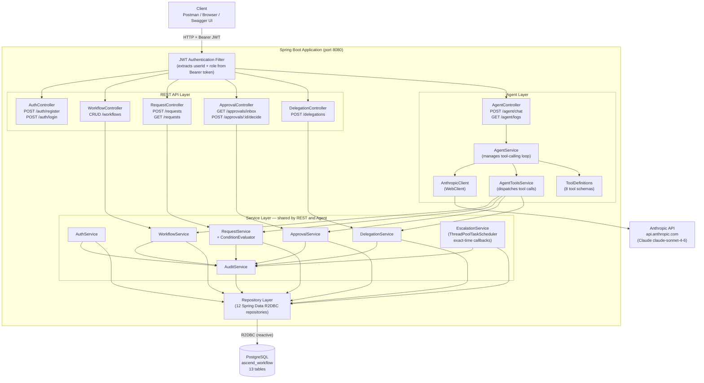
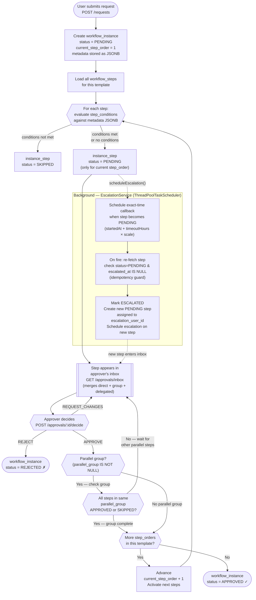
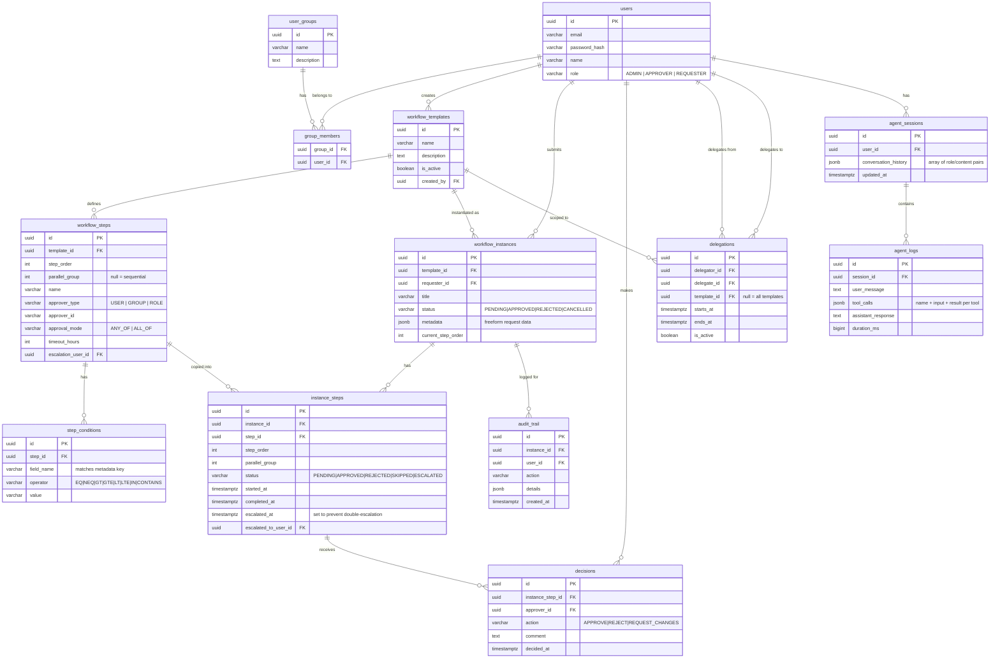

# Architecture Diagrams

## 1. System Architecture

```mermaid
graph TB
    Client["Client\nPostman / Browser / Swagger UI"]

    subgraph App["Spring Boot Application (port 8080)"]
        JWT["JWT Authentication Filter\n(extracts userId + role from Bearer token)"]

        subgraph REST["REST API Layer"]
            AuthCtrl["AuthController\nPOST /auth/register\nPOST /auth/login"]
            WorkflowCtrl["WorkflowController\nCRUD /workflows"]
            RequestCtrl["RequestController\nPOST /requests\nGET  /requests"]
            ApprovalCtrl["ApprovalController\nGET  /approvals/inbox\nPOST /approvals/:id/decide"]
            DelegationCtrl["DelegationController\nPOST /delegations"]
        end

        subgraph Agent["Agent Layer"]
            AgentCtrl["AgentController\nPOST /agent/chat\nGET  /agent/logs"]
            AgentSvc["AgentService\n(manages tool-calling loop)"]
            ToolDefs["ToolDefinitions\n(8 tool schemas)"]
            AgentTools["AgentToolsService\n(dispatches tool calls)"]
            AnthropicClient["AnthropicClient\n(WebClient)"]
        end

        subgraph Services["Service Layer  —  shared by REST and Agent"]
            AuthSvc["AuthService"]
            WorkflowSvc["WorkflowService"]
            RequestSvc["RequestService\n+ ConditionEvaluator"]
            ApprovalSvc["ApprovalService"]
            DelegationSvc["DelegationService"]
            EscalationSched["EscalationService\n(ThreadPoolTaskScheduler\nexact-time callbacks)"]
            AuditSvc["AuditService"]
        end

        Repos["Repository Layer\n(12 Spring Data R2DBC repositories)"]
    end

    DB[("PostgreSQL\nascend_workflow\n13 tables")]
    AnthropicAPI["Anthropic API\napi.anthropic.com\n(Claude claude-sonnet-4-6)"]

    Client -->|"HTTP + Bearer JWT"| JWT
    JWT --> AuthCtrl & WorkflowCtrl & RequestCtrl & ApprovalCtrl & DelegationCtrl & AgentCtrl

    AgentCtrl --> AgentSvc
    AgentSvc --> AnthropicClient --> AnthropicAPI
    AgentSvc --> AgentTools
    AgentSvc --> ToolDefs

    AgentTools --> WorkflowSvc & RequestSvc & ApprovalSvc & DelegationSvc

    WorkflowCtrl --> WorkflowSvc
    RequestCtrl --> RequestSvc
    ApprovalCtrl --> ApprovalSvc
    DelegationCtrl --> DelegationSvc

    WorkflowSvc & RequestSvc & ApprovalSvc & DelegationSvc & AuthSvc & EscalationSched --> AuditSvc
    WorkflowSvc & RequestSvc & ApprovalSvc & DelegationSvc & AuthSvc & EscalationSched & AuditSvc --> Repos
    Repos -->|"R2DBC (reactive)"| DB
```

---

## 2. Workflow Execution Flow

```mermaid
flowchart TD
    A([User submits request\nPOST /requests]) --> B

    B["Create workflow_instance\nstatus = PENDING\ncurrent_step_order = 1\nmetadata stored as JSONB"]

    B --> C["Load all workflow_steps\nfor this template"]

    C --> D{{"For each step:\nevaluate step_conditions\nagainst metadata JSONB"}}

    D -->|"conditions not met"| E["instance_step\nstatus = SKIPPED"]
    D -->|"conditions met\nor no conditions"| F["instance_step\nstatus = PENDING\n(only for current step_order)"]

    F --> G[["Step appears in\napprover's inbox\nGET /approvals/inbox\n(merges direct + group + delegated)"]]

    G --> H{{"Approver decides\nPOST /approvals/:id/decide"}}

    H -->|"REJECT"| I(["workflow_instance\nstatus = REJECTED ✗"])

    H -->|"REQUEST_CHANGES"| G

    H -->|"APPROVE"| J{{"Parallel group?\n(parallel_group IS NOT NULL)"}}

    J -->|"Yes — check group"| K{{"All steps in same\nparallel_group\nAPPROVED or SKIPPED?"}}

    K -->|"No — wait for\nother parallel steps"| G

    K -->|"Yes — group complete"| L

    J -->|"No parallel group"| L

    L{{"More step_orders\nin this template?"}}

    L -->|"Yes"| M["Advance\ncurrent_step_order + 1\nActivate next steps"]
    M --> D

    L -->|"No"| N(["workflow_instance\nstatus = APPROVED ✓"])

    subgraph Escalation["Background — EscalationService (ThreadPoolTaskScheduler)"]
        ES1["Schedule exact-time callback\nwhen step becomes PENDING\n(startedAt + timeoutHours × scale)"]
        ES2["On fire: re-fetch step\ncheck status=PENDING & escalated_at IS NULL\n(idempotency guard)"]
        ES3["Mark ESCALATED\nCreate new PENDING step\nassigned to escalation_user_id\nSchedule escalation on new step"]
        ES1 --> ES2 --> ES3
    end

    F -.->|"scheduleEscalation()"| ES1
    ES3 -.->|"new step enters inbox"| G
```

---

## 3. Data Model

```mermaid
erDiagram
    users {
        uuid id PK
        varchar email
        varchar password_hash
        varchar name
        varchar role "ADMIN | APPROVER | REQUESTER"
    }

    user_groups {
        uuid id PK
        varchar name
        text description
    }

    group_members {
        uuid group_id FK
        uuid user_id FK
    }

    workflow_templates {
        uuid id PK
        varchar name
        text description
        boolean is_active
        uuid created_by FK
    }

    workflow_steps {
        uuid id PK
        uuid template_id FK
        int step_order
        int parallel_group "null = sequential"
        varchar name
        varchar approver_type "USER | GROUP | ROLE"
        varchar approver_id
        varchar approval_mode "ANY_OF | ALL_OF"
        int timeout_hours
        uuid escalation_user_id FK
    }

    step_conditions {
        uuid id PK
        uuid step_id FK
        varchar field_name "matches metadata key"
        varchar operator "EQ|NEQ|GT|GTE|LT|LTE|IN|CONTAINS"
        varchar value
    }

    workflow_instances {
        uuid id PK
        uuid template_id FK
        uuid requester_id FK
        varchar title
        varchar status "PENDING|APPROVED|REJECTED|CANCELLED"
        jsonb metadata "freeform request data"
        int current_step_order
    }

    instance_steps {
        uuid id PK
        uuid instance_id FK
        uuid step_id FK
        int step_order
        int parallel_group
        varchar status "PENDING|APPROVED|REJECTED|SKIPPED|ESCALATED"
        timestamptz started_at
        timestamptz completed_at
        timestamptz escalated_at "set to prevent double-escalation"
        uuid escalated_to_user_id FK
    }

    decisions {
        uuid id PK
        uuid instance_step_id FK
        uuid approver_id FK
        varchar action "APPROVE|REJECT|REQUEST_CHANGES"
        text comment
        timestamptz decided_at
    }

    delegations {
        uuid id PK
        uuid delegator_id FK
        uuid delegate_id FK
        uuid template_id FK "null = all templates"
        timestamptz starts_at
        timestamptz ends_at
        boolean is_active
    }

    audit_trail {
        uuid id PK
        uuid instance_id FK
        uuid user_id FK
        varchar action
        jsonb details
        timestamptz created_at
    }

    agent_sessions {
        uuid id PK
        uuid user_id FK
        jsonb conversation_history "array of role/content pairs"
        timestamptz updated_at
    }

    agent_logs {
        uuid id PK
        uuid session_id FK
        text user_message
        jsonb tool_calls "name + input + result per tool"
        text assistant_response
        bigint duration_ms
    }

    users            ||--o{ group_members      : "belongs to"
    user_groups      ||--o{ group_members      : "has"
    users            ||--o{ workflow_templates  : "creates"
    workflow_templates ||--o{ workflow_steps    : "defines"
    workflow_steps   ||--o{ step_conditions    : "has"
    users            ||--o{ workflow_instances  : "submits"
    workflow_templates ||--o{ workflow_instances : "instantiated as"
    workflow_instances ||--o{ instance_steps   : "has"
    workflow_steps   ||--o{ instance_steps     : "copied into"
    instance_steps   ||--o{ decisions          : "receives"
    users            ||--o{ decisions          : "makes"
    users            ||--o{ delegations        : "delegates from"
    users            ||--o{ delegations        : "delegates to"
    workflow_templates ||--o{ delegations      : "scoped to"
    workflow_instances ||--o{ audit_trail      : "logged for"
    users            ||--o{ agent_sessions     : "has"
    agent_sessions   ||--o{ agent_logs         : "contains"
```
