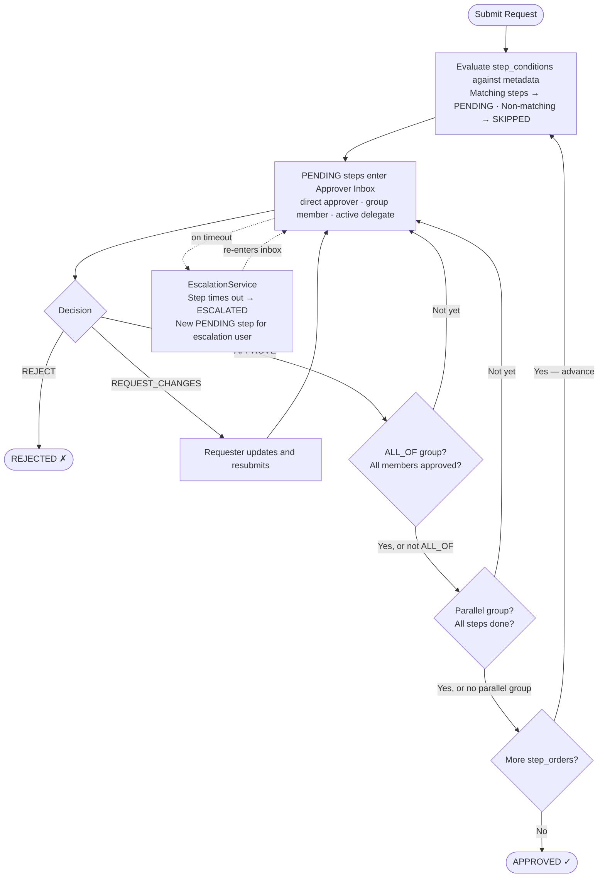
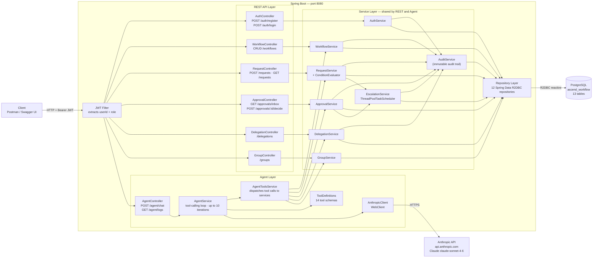
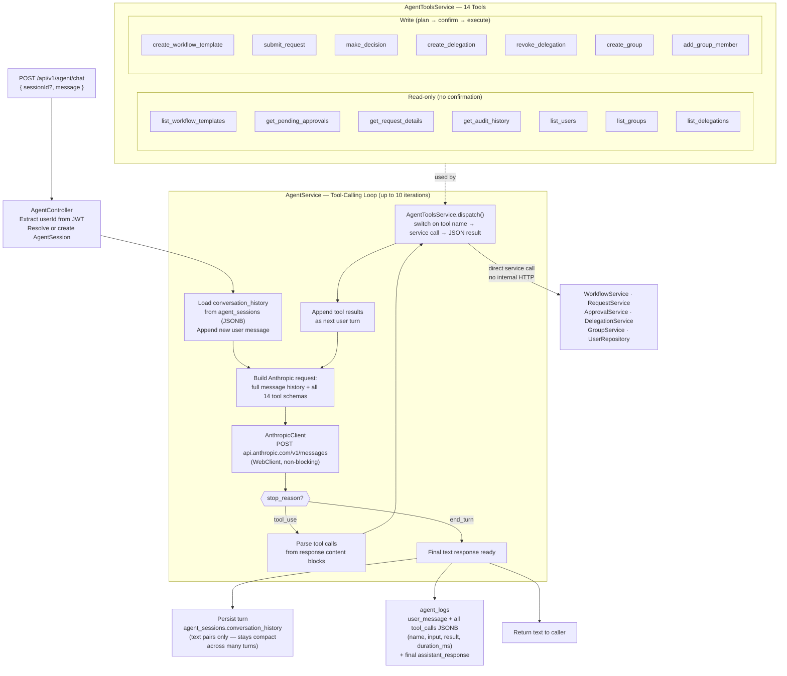
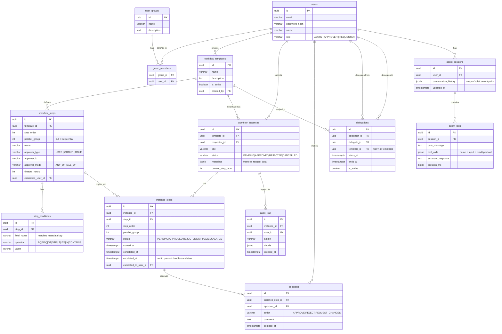

# Architecture Diagrams

## 1. Workflow Execution Flow

---

## 2. System Architecture

---

## 3. Agent Layer — Detailed

**Key design points for the walkthrough:**
- The loop runs entirely server-side — the client sends one HTTP request and gets one response back
- Read tools execute immediately; write tools always present a plan and wait for the user to say "yes" before calling the tool
- `conversation_history` stores only text pairs (compact); full tool traces go to `agent_logs` for observability
- `AgentToolsService` calls service classes directly — no internal HTTP, no re-auth

---

## 4. Data Model

